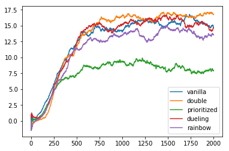

### Before you read

I applied thee improvement algorithm(`Double DQN`,`Prioritized Experience Replay`,`Dueling DQN`). 
`rainbow` is an algorithm that combines three algorithms. Prioritized Experience ReplayBuffer mostly stolen from [openai](https://github.com/openai/baselines/blob/master/baselines/deepq/replay_buffer.py). Fix Sample function for pytorch.

### Learning Algorithm

My basic DQN model consist of 3 layers. When you select `dueling` or `rainbow`, state value is estimated by another 3 layers.
`double` DQN helps Q not get too large. 

### Hyperparameters
Parameter | Value
--- | ---
learning rate | 0.0005
replay memory | 100000
num episodes | 2000
batch size | 64
update every | 4
gamma | 0.99
tau | 0.001
epsilon start | 1.0
epsilon end | 0.01
epsilon decay | 0.995
PRIORITIZED_ALPHA | 0.6
PRIORITIZED_BETA | 0.4
PRIORITIZED_EPS | 1e-6

### Comparison

The scores in the table below are the average scores.

Episodes | Vanilla | Double | Prioritized | Dueling | Rainbow
--- | --- | --- | --- | --- | --- |
100 | 1.26 | 0.24 | 0.73 | 0.58 | 0.41
200 | 4.02 | 1.84 | 3.15 | 3.04 | 2.74
300 | 7.62 | 6.77 | 5.88 | 7.19 | 6.42
400 | 10.07 | 10.03 | 6.70 | 9.28 | 8.36
500 | 12.28 | 11.53 | 7.29 | 12.27 | 11.39
600 | 13.76 | 13.84 | 8.63 | 14.38 | 12.35
700 | 14.73 | 15.05 | 8.48 | 15.24 | 12.94
800 | 14.24 | 16.01 | 8.91 | 14.89 | 12.55
900 | 14.57 | 15.74 | 8.89 | 13.96 | 13.41
1000 | 14.00 | 16.60 | 9.42 | 15.24 | 13.54
1100 | 15.39 | 16.42 | 8.88 | 15.96 | 14.17
1200 | 15.77 | 16.15 | 9.48 | 14.92 | 13.32
1300 | 15.62 | 15.88 | 9.16 | 16.19 | 12.78
1400 | 15.36 | 16.45 | 8.63 | 16.09 | 13.97
1500 | 15.13 | 17.02 | 7.92 | 16.13 | 14.69
1600 | 15.34 | 16.45 | 8.75 | 16.55 | 14.56
1700 | 16.49 | 16.76 | 8.01 | 14.68 | 14.18
1800 | 15.81 | 16.19 | 7.60 | 15.46 | 13.71
1900 | 15.31 | 16.92 | 7.73 | 15.27 | 13.14
2000 | 14.74 | 16.72 | 7.92 | 14.61 | 13.56

Double DQN alogrithm was best algorithm in my experiment. 

### Future work

I've got bad score with `Prioritized Experience Replay`. I have to find the reason what i missed.
And i didn't apply prioritized weight with beta for backpropagation. It is remain to do.
Maybe, These problems lead to rainbow's bad score.
